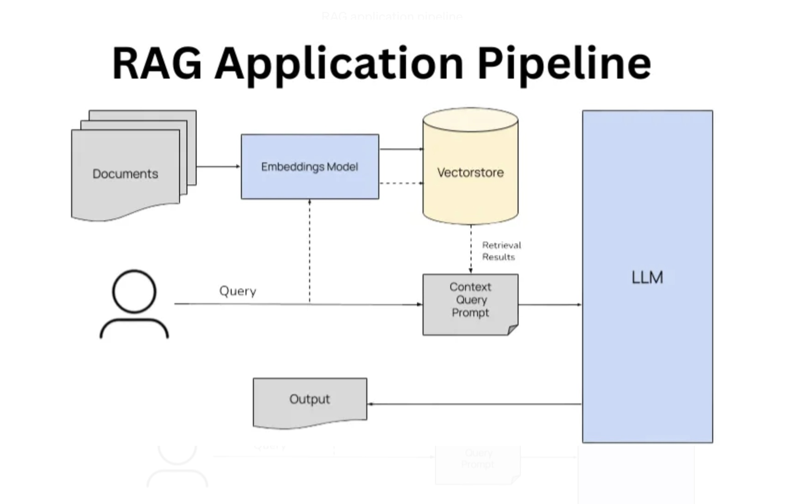

## Materials for London-NY People Analytics Meetup July 2024

These materials allow you to test and build a simple Generative AI application
from scratch using a Retrieval Augmented Generation (RAG) architecture.  RAG architectures 
allow greater injection of useful information and context into the prompt sent to a language model.

The project converts a large set of comments from readers of the NY Times into vector embeddings and stores them in a 
local ChromaDB vector database.  This is then used to provide context to a questions asked about the opinions of NY Times readers
on specific issues.

### Prerequisites

To fully complete this build you will need:

1. A high specification computer, ideally with high RAM and high CPU, and preferably with GPU.  
2. Access to the OpenAI API
3. `ollama` installed on your machines (see https://ollama.com)
4. API access to Kaggle, with the credentials stored in the `kaggle.json` inside the root directory of this project
5. All environment variables stored in a `.env` file in the root of this project.

### Steps

1. Use `requirements.txt` to set up your Python environment. 
2. Create the vector database and test it using the scripts located in `chromadb_prep`
3. Test various versions of the RAG architecture with different language models using the notebooks in `jupyter_test_rag_pipeline`
4. Launch the streamlit app using `streamlit run app/app.py` from project root in the terminal

